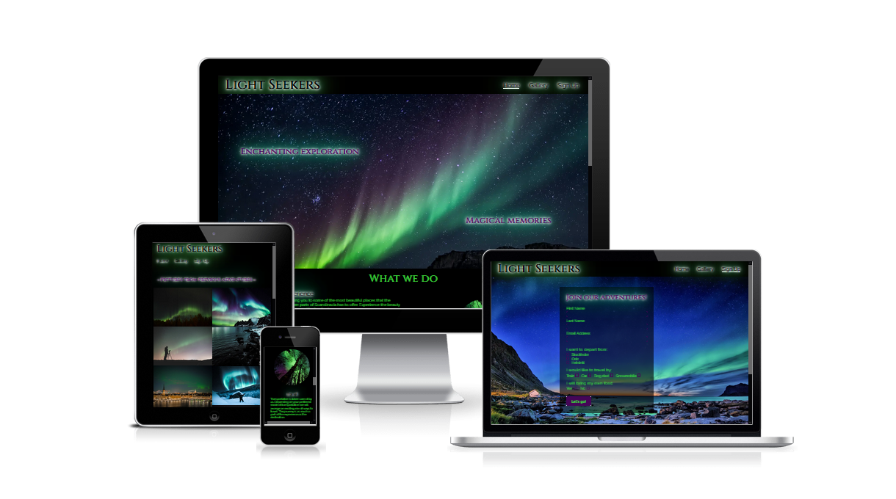
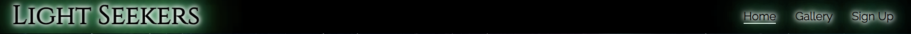
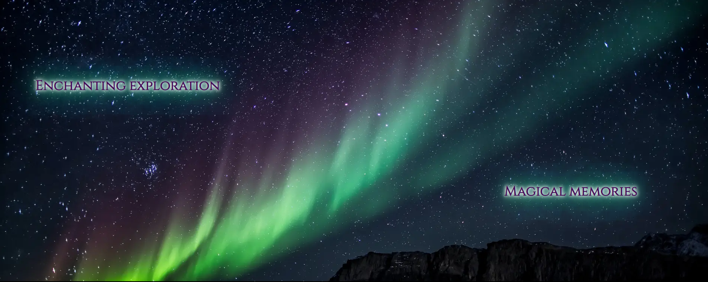
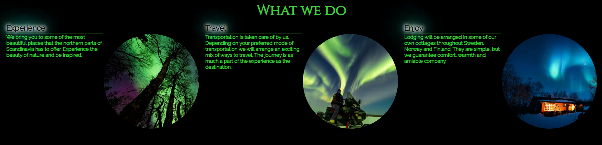

# Light Seekers

Light seekers is a site for people who want to experience the beauty and wonder of the aurora borealis in the northern parts of Scandinavia. The target audience for this site are people who maybe do not know where, when and how to best experience the northern lights. On the site adventurers can find information about where they can meet like-minded individuals who are looking for the same experience as they are and who can, through experience and resources, provide a more accessible way of experiencing this magnificent natural phenomenon.

Visitors to the site can sign up and join the Light Seekers club, which already contains several members who annually seek out the northern lights while, for a fee, providing not only transportation and lodging but also food, if so desired, for both new and experienced adventurers alike. The aim of the site is to provide an easy starting point for those who do not wish to embark on this adventure alone.

## Features

* Navigation Bar
  - Fully responsive and can be found on all three pages. Allows users to easily navigate the site and will prevent users from getting lost when navigating the site. Includes links to the Home page, the Gallery, the Sign up page as well as the Logo.
  - The bar remains identical on all three pages in order to make navigation as easy as possible. It also removes the need to use the browsers built-in "back" and "forward" buttons while using the site.

* Landing page image
  - The landing consists of a colorful image to catch the users attention. The picture is of the northern lights which is the main focus of the site.
  - In addition to the image an animation will make two bits of text fade in further enticing the user to keep exploring the site.

* The "What we do"- section
  - This section lets the user know what, exactly, this club is about and what its members do. 
  - It is divided into three parts where each part focuses on an important aspect of the experience that the club offers.
  - Each part is accompanied by a small image to give the user a visual representation in addition to what the text offers.

* Information table
  - A table with the most relevant basic information.