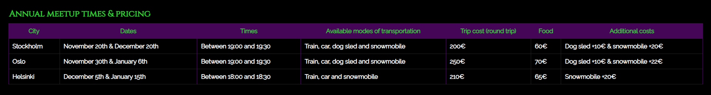
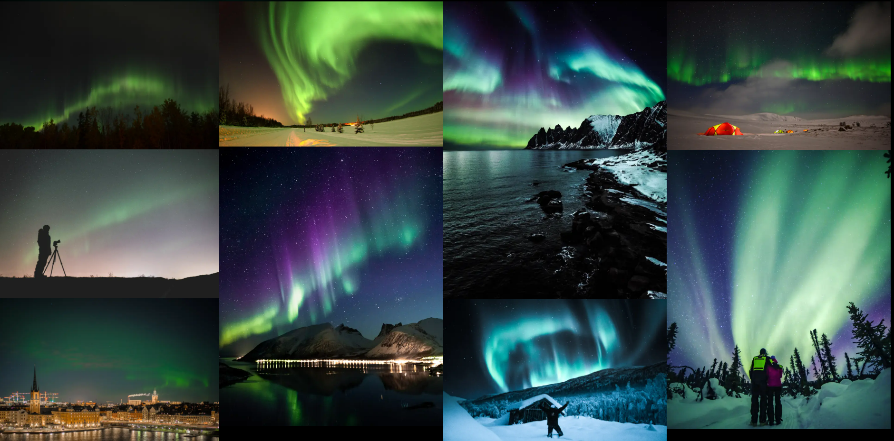
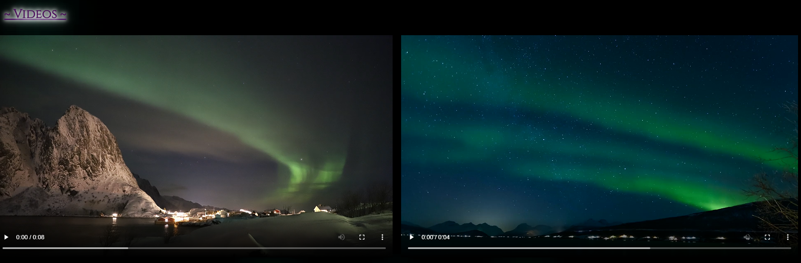
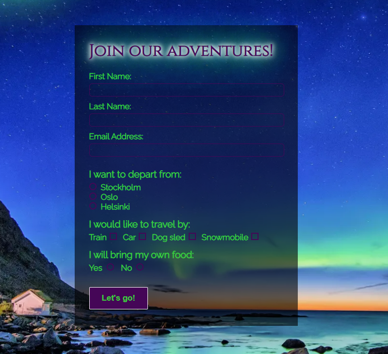
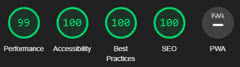

# Light Seekers

Light seekers is a site for people who want to experience the beauty and wonder of the aurora borealis in the northern parts of Scandinavia. The target audience for this site are people who maybe do not know where, when and how to best experience the northern lights. On the site adventurers can find information about where they can meet like-minded individuals who are looking for the same experience as they are and who can, through experience and resources, provide a more accessible way of experiencing this magnificent natural phenomenon.

Visitors to the site can sign up and join the Light Seekers club, which already contains several members who annually seek out the northern lights while, for a fee, providing not only transportation and lodging but also food, if so desired, for both new and experienced adventurers alike. The aim of the site is to provide an easy starting point for those who do not wish to embark on this adventure alone.

## Features

* Navigation Bar
  - Fully responsive and can be found on all three pages. Allows users to easily navigate the site and will prevent users from getting lost when navigating the site. Includes links to the Home page, the Gallery, the Sign up page as well as the Logo.
  - The bar remains identical on all three pages in order to make navigation as easy as possible. It also removes the need to use the browsers built-in "back" and "forward" buttons while using the site.

* Landing Page Image
  - The landing consists of a colorful image to catch the users attention. The picture is of the northern lights which is the main focus of the site.
  - In addition to the image an animation will make two bits of text fade in further enticing the user to keep exploring the site.

* The "What we do"- section
  - This section lets the user know what, exactly, this club is about and what its members do. 
  - It is divided into three parts where each part focuses on an important aspect of the experience that the club offers.
  - Each part is accompanied by a small image to give the user a visual representation in addition to what the text offers.

* Information Table
  - A table with the most relevant basic information. The user can find meetup positions, times, available ways to travel as well as how much it will cost.
  - It is fully responsive and will change its layout for smaller screens.
  - The information in the table will be updated if there is any change to the annual meetups.

* The Footer
  - Provides links to all of Light Seekers social media sites. All links will open up in new tabs for easier navigation.
  - Gives the users further incentive to engage and interact with current members of the club.
  - Can be found on every part of the site and maintains its position and appearance in order to facilitate navigation.

* Gallery
  - Contains images and videos from previous adventures and gives the user an idea of what to expect during the journey. It serves as a compliment to the landing page and is a vital part of the user's first impression.
  - All videos are off by default and give the user full control in order to avoid minor annoyances such as sound playing without the users consent.

* The Sign Up Page
  - This part of the site allows the user to sign up for membership in the club. The user will be asked to input some basic personal information so that they can be contacted and be given more detailed information regarding upcoming adventures. The form also asks the user to input some basic preferences so that the organizers can start planning upcoming trips.

## Testing

* I have tested that the site works in the following browsers: Firefox, Google Chrome and Microsoft Edge.

* I can confirm that the site is responsive, i.e. looks good and functions, on all common screen sizes.

* I can confirm that all elements of the site (information, navigation, the form etc.) are easy to read and understand.

* I have tested the videos to ensure that they are both playable and that they give the user full control over how and when they are played.

* I have tested the form and can confirm that it works as intended: all required fields require input, the email field will only accept email addresses, the submit button works and the correct relevant information is sent to the server.

* I can confirm that all links, both internal and external, work as intended and that all external links open up in a new tab.

 

### Bugs

* No major or unusual bugs were encountered during development.

 

### Validator Testing

* HTML
  - No errors were returned when passed through the official [W3C HTML validator](https://validator.w3.org/nu/?doc=https%3A%2F%2Fdrakain.github.io%2Flight-seekers%2Findex.html).

* CSS
  - No errors were returned when passed through the official [W3C CSS validator](https://jigsaw.w3.org/css-validator/validator?uri=https%3A%2F%2Fdrakain.github.io%2Flight-seekers%2Findex.html&profile=css3svg&usermedium=all&warning=1&vextwarning=&lang=en).

* Lighthouse
  - I confirmed that the site is accessible and has good a performance score through Lighthouse in devtools.

      

   

  ### Unfixed Bugs

  * There are no unfixed bugs.

   

  ## Deployment

  * The site was deployed to GitHub pages. The deployment steps are as follows:
    1. Enter the GitHub repository.
    2. Navigate to the "Settings" tab.
    3. Find the "Pages" tab in the menu to the left and click it.
    4. Find the "Select branch" drop-down menu under the "Branch" heading.
    5. Select "main" as your branch and save.
    6. Refresh the page after a short while in order to be provided with a link to the now deployed site.

   

  * The live link can be found [here](https://drakain.github.io/light-seekers/index.html).

   

  ## Credits

  ### Content

  * The social media icons were taken from [Font Awesome](https://fontawesome.com/).

   

  ### Media

  * All pictures and videos were taken from [Pexels](https://www.pexels.com/).